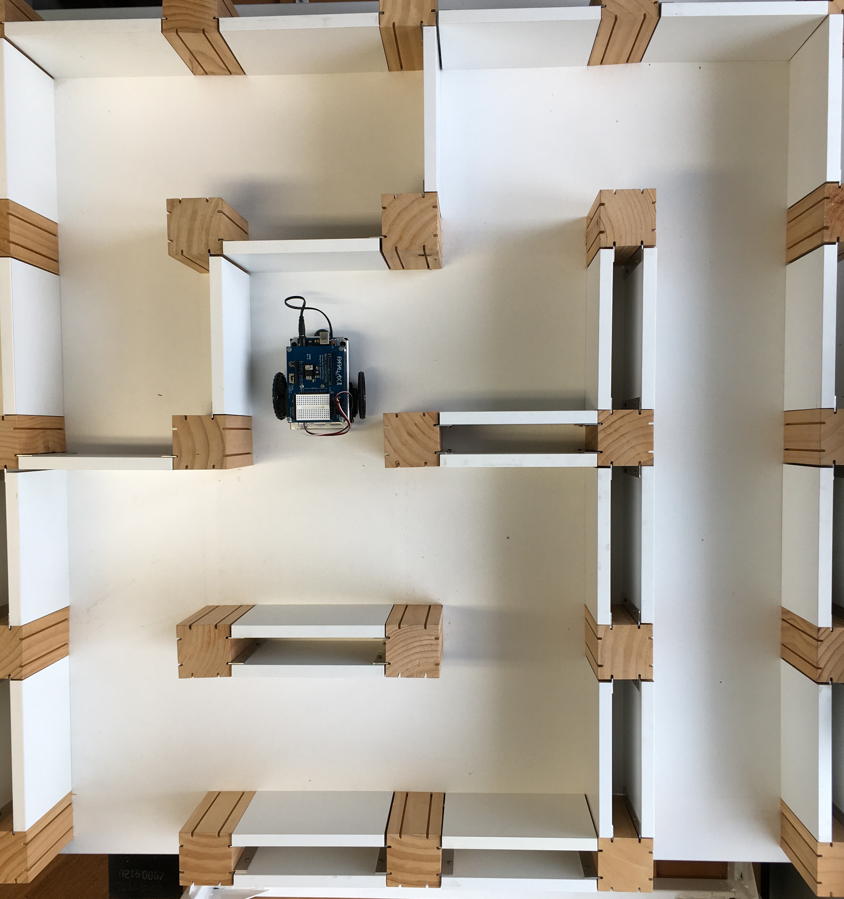
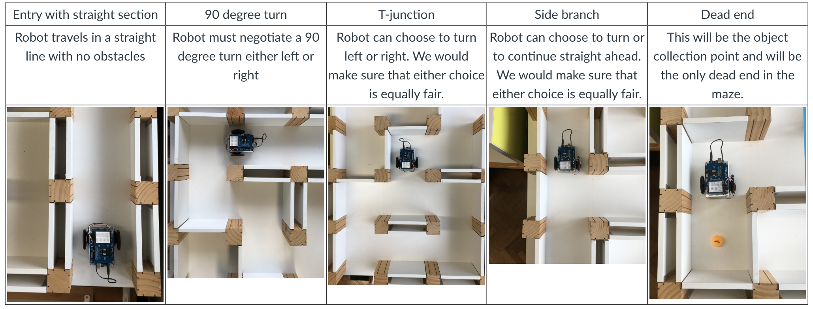

# Autonomous Maze-Navigating Robot with Bluetooth Communication

This project involves the development of an autonomous robot capable of navigating a maze or track, locating a target object (e.g., a ping pong ball), and communicating its status to the user via Bluetooth. The robot demonstrates advanced navigation, object detection, and two-way communication capabilities, with additional features for automation, memory-based navigation, and autonomous object retrieval.

## Maze Overview
Below is an overview of the maze layout that the robot navigates:

  
*Figure 1: Maze layout for the autonomous robot navigation.*

## Key Functionalities

### 1. Two-Way Bluetooth Communication
- The robot supports real-time two-way communication via Bluetooth.
- Users can send navigation commands (e.g., manual control to the maze entry point) and receive status updates (e.g., object detection, task completion).

### 2. Autonomous Maze Navigation 
- Once manually guided to the maze entry point, the robot autonomously navigates the maze or track to locate the target object.
- Uses sensors (e.g., ultrasonic, infrared) to avoid obstacles and find the most efficient path to the object.

  
*Figure 2: Autonomous Maze Navigation.*

### 3. Object Detection and Retrieval
- Upon locating the object (a ping pong ball), the robot informs the user via Bluetooth. The object detection part of the work, please refer to https://github.com/Hansxsourse/Rapberry-Pi-Object-Detection.
- Autonomously picks up the ball using a custom-designed mechanical arm, ensuring the object is securely carried to the designated destination.

### 4. Memory-Based Automation
- The robot can repeat the navigation process from the start point to the object collection point without manual intervention.
- Leverages memory to store and recall the optimal path, ensuring consistent performance within a defined tolerance.

### 5. Return to Start Point
- The robot can autonomously return from the object collection point to the start point.
- Utilizes its memory to retrace the path, demonstrating full automation and efficient use of resources.

## Technical Highlights
- **Bluetooth Integration**: Enables seamless communication between the robot and the user interface.
- **Obstacle Avoidance**: Uses sensors (e.g., ultrasonic, infrared) to detect and navigate around obstacles.
- **Path Optimization**: Implements algorithms for efficient maze navigation and path memorization.
- **Autonomous Object Retrieval**: Includes a mechanical arm or trapping mechanism to pick up a ping pong ball autonomously.
